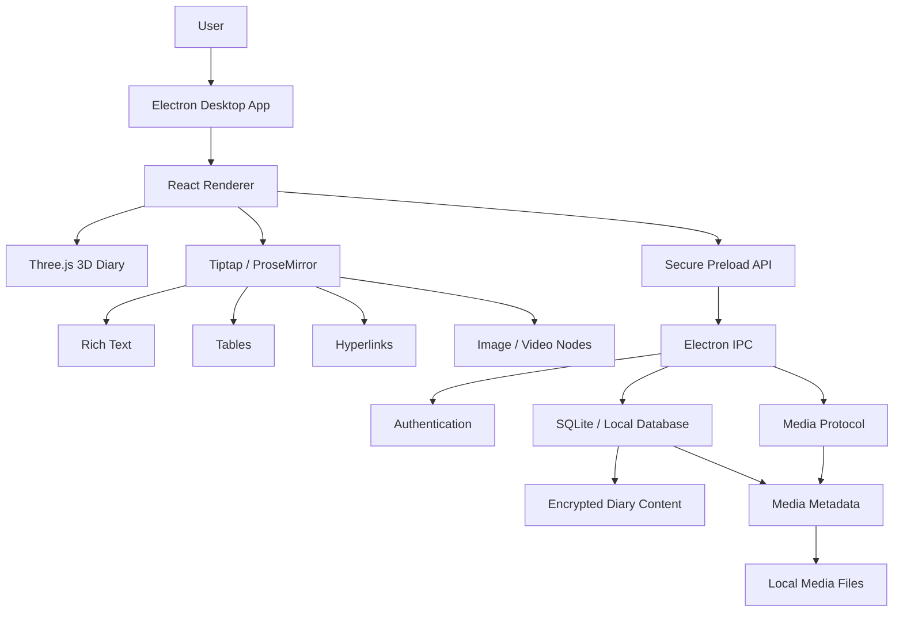
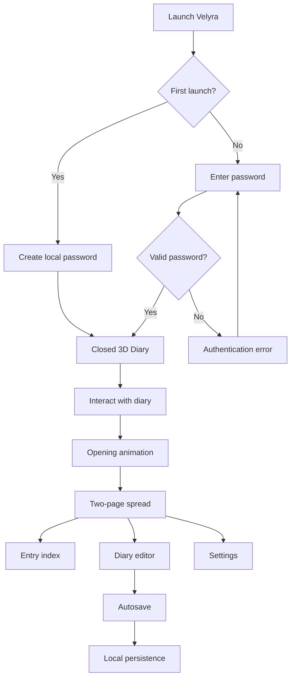
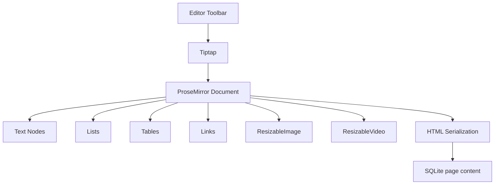
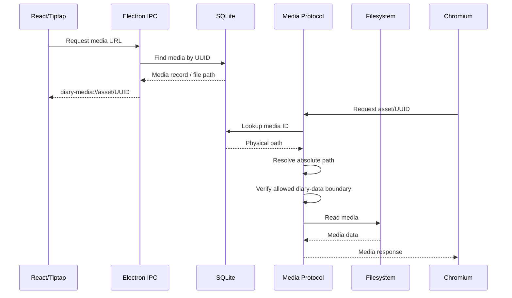
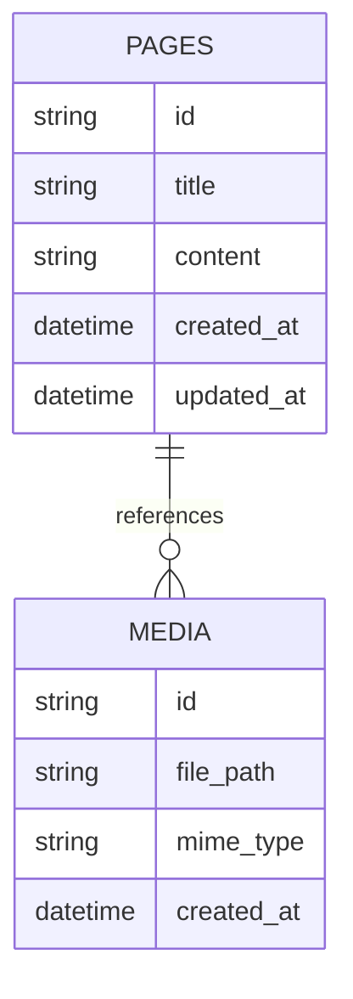
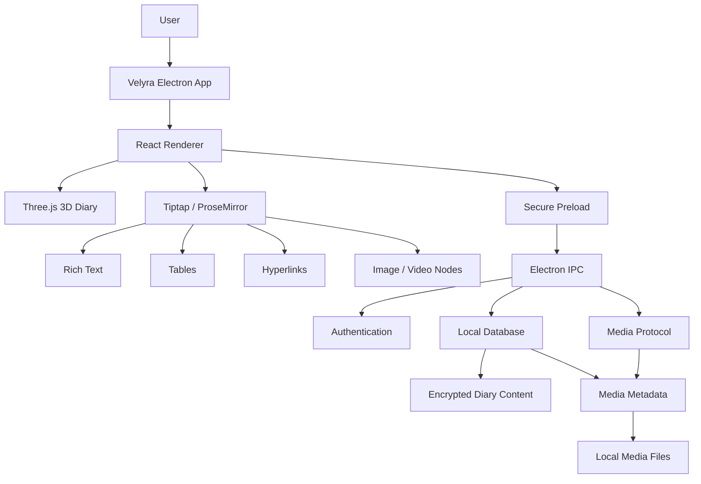

# Velyra

> **A private, offline-first 3D desktop diary that combines secure local
> journaling, rich-text and multimedia editing, and an immersive antique
> 3D book experience.**

```{=html}
<p align="center">
```
`<strong>`{=html}Write. Remember. Experience.`</strong>`{=html}
```{=html}
</p>
```
Velyra is a Windows desktop diary built with **Electron, React,
TypeScript, Vite, Three.js, Tiptap, ProseMirror, and SQLite**. It is
designed to make a digital diary feel more like a physical antique
journal while still providing modern document-editing capabilities.

The application combines:

-   An immersive **3D antique diary**
-   A modern **rich-text editor**
-   Native **image and video embedding**
-   Media resizing, alignment, and text wrapping
-   Tables and hyperlinks
-   Local persistence
-   Encrypted diary content
-   Secure Electron IPC
-   An opaque-ID media protocol
-   Offline-first operation
-   Windows installer and portable builds

------------------------------------------------------------------------

## 📥 Download Velyra

### Windows — Velyra 1.0.0

[](https://github.com/AnimeshSingh913/Velyra---Diary/releases/tag/v1.0.0)

**[⬇️ Download Velyra 1.0.0](https://github.com/AnimeshSingh913/Velyra---Diary/releases/tag/v1.0.0)**

Available downloads:

- **Windows Installer:** `velyra-1.0.0-setup.exe`
- **Portable Version:** `Velyra 1.0.0.exe`

Velyra is an offline-first desktop application. Core diary functionality does not require an internet connection.

> **Latest release:** `v1.0.0`

---

## Table of Contents

-   [Overview](#overview)
-   [Goals](#goals)
-   [Key Features](#key-features)
-   [Technology Stack](#technology-stack)
-   [System Architecture](#system-architecture)
-   [Application Flow](#application-flow)
-   [3D Diary Experience](#3d-diary-experience)
-   [Rich Text Editor](#rich-text-editor)
-   [Media System](#media-system)
-   [Media Protocol and Security](#media-protocol-and-security)
-   [Database and Persistence](#database-and-persistence)
-   [Authentication and Privacy](#authentication-and-privacy)
-   [Offline-First Design](#offline-first-design)
-   [Project Structure](#project-structure)
-   [Development Stages](#development-stages)
-   [Testing and QA](#testing-and-qa)
-   [Installation and Development](#installation-and-development)
-   [Windows Packaging](#windows-packaging)
-   [Current Status](#current-status)
-   [Future Improvements](#future-improvements)
-   [Design Philosophy](#design-philosophy)
-   [License](#license)

------------------------------------------------------------------------

# Overview

Velyra is designed around the idea that a digital diary should feel like
a **physical diary rather than a conventional dashboard**.

``` text
                  ┌──────────────────────┐
                  │        VELYRA        │
                  │   Private 3D Diary   │
                  └──────────┬───────────┘
                             │
             ┌───────────────┼───────────────┐
             ▼               ▼               ▼
       ┌──────────┐    ┌────────────┐   ┌─────────────┐
       │ 3D Book  │    │ Rich Text  │   │ Local Data  │
       │  Scene   │    │ + Media    │   │ + Security  │
       └──────────┘    └────────────┘   └─────────────┘
```

The core application is intended to operate locally without requiring a
cloud diary service.

## Core principles

  Principle                  Implementation
  -------------------------- --------------------------------------------------
  Offline-first              Diary data and media remain local
  Privacy                    Local authentication and encrypted diary content
  Rich editing               Tiptap / ProseMirror
  Multimedia                 Native document image/video nodes
  Physical-book experience   Three.js 3D diary
  Persistence                SQLite/local database layer
  Desktop integration        Electron
  Security                   Preload bridge, IPC, and controlled media access
  Compatibility              Runtime support for legacy diary content

------------------------------------------------------------------------

# Goals

  Goal                              Status
  -------------------------------- --------
  Immersive 3D diary                  ✅
  Local-first persistence             ✅
  Offline operation                   ✅
  Local password protection           ✅
  Rich text editing                   ✅
  Images and videos                   ✅
  Media resizing and positioning      ✅
  Autosave                            ✅
  Interactive book manipulation       ✅
  Tables                              ✅
  Hyperlinks                          ✅
  Windows installer                   ✅
  Portable Windows build              ✅

------------------------------------------------------------------------

# Key Features

## 📖 3D Diary

-   Antique physical-book presentation
-   Detailed book geometry
-   Covers, spine, page block, page layers, ribbon and clasp
-   Gold ornamentation
-   Procedural leather surface detail
-   PBR-style gold and page materials
-   Cinematic study background
-   Background blur during diary opening/closing
-   Page-opening and closing animations
-   Mouse-controlled book rotation
-   Smooth return-to-rest behavior
-   Bounded pitch/yaw interaction

## ✍️ Rich Text Editor

-   Bold
-   Italic
-   Underline
-   Strikethrough
-   Superscript
-   Subscript
-   Headings
-   Font controls
-   Text size
-   Text color
-   Alignment
-   Indentation
-   Bulleted lists
-   Numbered lists
-   Blockquotes
-   Clear formatting
-   Undo / redo
-   Hyperlinks
-   Tables

## 🖼️ Embedded Media

Images and videos are integrated directly into the diary document rather
than being treated as a separate gallery.

``` text
Diary Entry
│
├── Paragraph
├── Paragraph
├── Image
├── Paragraph beside image
├── Video
└── Paragraph
```

Media supports:

-   Cursor-based insertion
-   Resizing
-   Size presets
-   Manual drag resizing
-   Left / center / right alignment
-   Wrap-left / wrap-right
-   Deletion
-   Persistence across restarts
-   Backward-compatible loading

------------------------------------------------------------------------

# Technology Stack

  -----------------------------------------------------------------------
  Layer                   Technology              Purpose
  ----------------------- ----------------------- -----------------------
  Desktop runtime         Electron                Windows desktop
                                                  application

  UI                      React                   Renderer interface

  Language                TypeScript              Type-safe application
                                                  development

  Build                   Vite / electron-vite    Development and
                                                  production builds

  3D                      Three.js                Diary/book rendering

  Rich text               Tiptap                  Editor framework

  Document model          ProseMirror             Structured document
                                                  editing

  Database                SQLite/local database   Local persistence
                          layer                   

  IPC                     Electron IPC            Controlled
                                                  main/renderer
                                                  communication

  Packaging               electron-builder        Windows installers

  Media access            `diary-media://`        Controlled local media
                          protocol                serving
  -----------------------------------------------------------------------

### Tiptap extensions

The editor uses official extensions including:

-   Link
-   Table
-   Table Row
-   Table Header
-   Table Cell
-   Strike
-   Subscript
-   Superscript

Custom extensions provide Velyra-specific behavior such as indentation
and resizable media.

------------------------------------------------------------------------

# System Architecture



------------------------------------------------------------------------

# Application Flow



------------------------------------------------------------------------

# 3D Diary Experience

Three.js provides Velyra's visual identity.

The 3D book is deliberately constrained rather than behaving like an
unrestricted 3D object.

## Scene composition

``` text
Three.js Scene
│
├── Cinematic Background
│   ├── Sharp texture
│   ├── Blurred texture
│   └── Shader blend
│
├── Diary Book
│   ├── Covers
│   ├── Spine
│   ├── Page block
│   ├── Page layers
│   ├── Ribbon
│   └── Clasp
│
├── Cover Ornamentation
│   ├── Gold border
│   ├── Corner details
│   ├── Central emblem
│   └── Filigree
│
└── Lighting
    ├── Warm key
    ├── Cool fill
    ├── Candle-like light
    └── Soft shadows
```

## PBR-oriented materials

  Material      Approach                  Purpose
  ------------- ------------------------- -----------------------------
  Leather       `MeshPhysicalMaterial`    Burgundy/mahogany cover
  Gold          `MeshPhysicalMaterial`    Antique metal ornamentation
  Pages         PBR-compatible material   Parchment appearance
  Environment   PMREM                     Material reflections

The leather uses procedural surface detail/bump, while the gold uses
high metalness with controlled roughness for restrained antique-metal
reflections.

## Background and environment

The visible cinematic background is treated separately from the
reflection environment.

``` text
              Velyra Rendering
                     │
          ┌──────────┴──────────┐
          ▼                     ▼
   Visible Background      PBR Environment
          │                     │
      16:9 image          Procedural scene
          │                     │
    Shader blend          PMREM.fromScene()
          │                     │
          ▼                     ▼
   User-visible study     scene.environment
                                │
                         ┌──────┼──────┐
                         ▼      ▼      ▼
                       Gold  Leather  Pages
```

Local background assets include:

``` text
diary_background.png
diary_background_blurred.png
```

A fullscreen shader blends between the sharp and blurred versions during
the diary transition.

------------------------------------------------------------------------

# Interactive 3D Book

Velyra supports mouse drag interaction for physically examining the
closed book.

``` text
                 Mouse Up
                    ↑
                    │
        ┌─────────────────────┐
        │                     │
Mouse ← │       VELYRA        │ → Mouse
        │        BOOK         │
        │                     │
        └─────────────────────┘
                    │
                    ↓
                 Mouse Down
```

### Interaction model

  Interaction          Result
  -------------------- ------------------------------------
  Normal click         Opens the book
  Small movement       Treated as a click
  Drag left/right      Y-axis rotation
  Drag up/down         X-axis tilt
  Release              Smooth return toward resting angle
  Excessive rotation   Prevented by limits

The current implementation uses an approximately **8px drag threshold**,
bounded pitch of about **±15°**, and bounded yaw of about **±30°**.

Pointer capture is used so dragging remains reliable even when the
pointer moves outside the original canvas region.

------------------------------------------------------------------------

# Rich Text Editor

Velyra uses Tiptap on top of ProseMirror.



## Editor feature matrix

  Category        Features
  --------------- --------------------------------
  Text            Bold, Italic, Underline
  Advanced text   Strike, Superscript, Subscript
  Headings        H1, H2, H3
  Font            Font controls
  Size            Text size
  Color           Text color
  Paragraph       Left, Center, Right, Justify
  Indentation     Increase / decrease
  Lists           Bulleted / numbered
  Quote           Blockquote
  Links           Hyperlinks
  Tables          Rows, columns, merge/split
  Media           Images and videos
  Media layout    Resize, align, wrap
  History         Undo / redo
  Cleanup         Clear formatting

------------------------------------------------------------------------

# Media System

The custom media nodes are:

``` text
ResizableImage
ResizableVideo
```

They remain block-level document nodes and store layout information such
as width, alignment, and wrapping.

## Media sizing

  Preset           Width
  -------- -------------
  Small              25%
  Medium             50%
  Large              75%
  Full              100%
  Custom     Manual drag

## Cursor-based insertion

Media is inserted at the user's actual editor position rather than
automatically appended to the end.

``` text
Before:

This is the first half. This is the second half.
                       ^
                     cursor


After:

This is the first half.

             [ IMAGE ]

This is the second half.
```

The implementation captures the ProseMirror selection before the
asynchronous file-picker operation and uses the saved position for
insertion.

## Text wrapping

``` text
┌──────────────────────────────────────────────┐
│ [ IMAGE ]   Text flows naturally around the │
│ [ IMAGE ]   media while the paragraph      │
│ [ IMAGE ]   continues beside it.           │
│             Additional text continues here. │
└──────────────────────────────────────────────┘
```

Supported modes:

  Mode             Behavior
  ---------------- ----------------------------------
  Block / Center   Media occupies its own block
  Wrap Left        Text flows around the right side
  Wrap Right       Text flows around the left side

------------------------------------------------------------------------

# Tables

Velyra supports structured tables directly inside diary entries.

  Operation        Supported
  --------------- -----------
  Insert table        ✅
  Edit cells          ✅
  Add row             ✅
  Delete row          ✅
  Add column          ✅
  Delete column       ✅
  Merge cells         ✅
  Split cells         ✅
  Delete table        ✅
  Undo / redo         ✅
  Persistence         ✅

Tables are constrained to the diary content area to avoid unwanted
overflow.

------------------------------------------------------------------------

# Hyperlinks

The Link extension supports:

``` text
Select text
     │
     ▼
Click Link
     │
     ▼
Velyra URL input
     │
     ▼
Enter URL
     │
     ▼
Apply
     │
     ▼
Selected text becomes hyperlink
```

A custom React URL input is used instead of `window.prompt()` because
the Electron renderer workflow does not reliably support the browser
prompt API.

Links can be persisted with diary content and opened through the
operating system's default browser.

------------------------------------------------------------------------

# Media Protocol and Security

## The Windows URL problem

Velyra originally attempted to expose Windows absolute filesystem paths
through the custom media protocol.

For example:

``` text
diary-media://C:/Users/...
```

Chromium can interpret the `C:` component as the host portion of a
standard URL. This causes the Windows drive-letter colon to be lost
before the request reaches the protocol handler.

The final architecture avoids filesystem paths in renderer URLs
completely.

## Final media URL

``` text
diary-media://asset/<mediaId>
```

The renderer receives an opaque media identity rather than a physical
Windows path.

## Final media flow



## Security boundary

``` text
diary-media://asset/<UUID>
            │
            ▼
      Validate media ID
            │
            ▼
      Query media record
            │
            ▼
       Obtain file path
            │
            ▼
     Resolve absolute path
            │
            ▼
   Inside allowed diary-data?
        /             \
      YES              NO
       │                │
       ▼                ▼
   Serve file       403 Forbidden
```

This architecture keeps physical filesystem paths inside the Electron
main process.

------------------------------------------------------------------------

# Database and Persistence

Velyra uses a local database for diary persistence.

The editor upgrade was designed to avoid destructive bulk migrations.

## Logical model



The diagram represents the logical relationship between diary content
and media metadata. The application's source code remains authoritative
for exact schema details.

## Persistence flow

``` text
User edits
    │
    ▼
Tiptap document
    │
    ▼
HTML serialization
    │
    ▼
Autosave
    │
    ▼
Local database
```

------------------------------------------------------------------------

# Authentication and Privacy

Velyra is designed as a private local diary.

Security architecture includes:

-   Local password authentication
-   Encrypted diary content
-   Secure preload bridge
-   Restricted IPC
-   Main-process database access
-   Controlled local media access
-   No required cloud diary service

``` text
React Renderer
      │
      ▼
Secure Preload
      │
      ▼
Restricted IPC
      │
      ▼
Electron Main
      │
 ┌────┴───────────┐
 ▼                ▼
Database       Local Files
```

The renderer does not receive unrestricted Node.js access.

------------------------------------------------------------------------

# Offline-First Design

Velyra is designed to operate without requiring a remote diary backend.

``` text
                  VELYRA
                    │
         ┌──────────┴──────────┐
         ▼                     ▼
       Runtime               Storage
         │                     │
 Electron / React         Local Database
 Three.js / Tiptap        Local Media
         │                 Local Assets
         └──────────┬──────────┘
                    ▼
              No cloud required
```

The core diary experience does not depend on:

-   Cloud diary synchronization
-   Remote AI services
-   CDN-hosted diary assets
-   Online image assets
-   Online fonts
-   Remote APIs

------------------------------------------------------------------------

# Project Structure

``` text
Velyra/
│
├── build/
│   └── Windows build resources
│
├── resources/
│   └── Packaged resources
│
├── src/
│   ├── main/
│   │   ├── main.ts
│   │   └── ipc/
│   │       └── index.ts
│   │
│   ├── preload/
│   │   └── preload.ts
│   │
│   ├── renderer/
│   │   ├── components/
│   │   │   ├── Diary3D/
│   │   │   │   ├── DiaryScene.ts
│   │   │   │   ├── DiaryBook.ts
│   │   │   │   ├── BookMaterials.ts
│   │   │   │   ├── CoverOrnaments.ts
│   │   │   │   └── LightingRig.ts
│   │   │   │
│   │   │   └── DiaryPages/
│   │   │       ├── DiaryEditor.tsx
│   │   │       ├── EditorToolbar.tsx
│   │   │       └── extensions/
│   │   │           ├── ResizableImage.ts
│   │   │           ├── ResizableVideo.ts
│   │   │           └── ResizableMediaNodeView.tsx
│   │   │
│   │   ├── styles/
│   │   │   └── editor.css
│   │   └── assets/
│   │
│   └── shared/
│
├── package.json
├── package-lock.json
├── electron.vite.config.ts
├── electron-builder.yml
├── tsconfig.json
├── tsconfig.node.json
└── tsconfig.web.json
```

------------------------------------------------------------------------

# Development Stages

The editor and media system were implemented incrementally.

    Stage Description                                  Status
  ------- ----------------------------------------- -------------
        1 Text formatting extensions                 ✅ Complete
        2 Cursor-based media insertion               ✅ Complete
        3 Width and alignment                        ✅ Complete
        4 Text wrapping and floating                 ✅ Complete
        5 Tables and hyperlinks                      ✅ Complete
        6 Data migration / backward compatibility    ✅ Complete
        7 Interactive 3D book mouse drag             ✅ Complete
    Final Opaque media-ID protocol                   ✅ Complete
    Final Production packaging                       ✅ Complete

------------------------------------------------------------------------

# Backward Compatibility

The editor upgrades were designed to avoid destructive database
migrations.

Older media may not contain newer attributes such as:

``` html
data-width
data-align
data-wrap
```

The editor provides compatibility defaults when these attributes are
missing.

## Compatibility flow

``` text
Old Diary Entry
      │
      ▼
Parse existing HTML
      │
      ▼
Tiptap compatibility defaults
      │
      ▼
Resolve existing media ID
      │
      ▼
New secure media URL
      │
      ▼
Render normally
```

The opaque media-ID architecture also allows legacy media records to
continue being resolved without requiring a risky bulk rewrite of the
database.

------------------------------------------------------------------------

# Testing and QA

## 3D testing

  Test                          Status
  ---------------------------- --------
  Closed diary                    ✅
  Opening animation               ✅
  Fully open diary                ✅
  Closing animation               ✅
  Cinematic background            ✅
  Background blur transition      ✅
  Gold material response          ✅
  Leather material response       ✅
  Page rendering                  ✅
  Mouse drag interaction          ✅

## Editor testing

  Test               Status
  ----------------- --------
  Text entry           ✅
  Formatting           ✅
  Headings             ✅
  Lists                ✅
  Indentation          ✅
  Undo / redo          ✅
  Image insertion      ✅
  Video insertion      ✅
  Media resizing       ✅
  Media alignment      ✅
  Text wrapping        ✅
  Tables               ✅
  Hyperlinks           ✅
  Persistence          ✅

## Security and storage testing

  Test                          Status
  ---------------------------- --------
  Authentication flow             ✅
  Local persistence               ✅
  Encrypted content               ✅
  IPC boundary                    ✅
  Media containment               ✅
  Legacy media compatibility      ✅
  Windows media protocol          ✅

## Media verification

For images, useful runtime checks include:

``` js
img.src
img.naturalWidth
img.naturalHeight
```

For videos:

``` js
video.src
video.duration
video.readyState
video.networkState
video.error
```

The expected renderer URL is:

``` text
diary-media://asset/<UUID>
```

A physical Windows path should not be exposed through the renderer media
URL.

------------------------------------------------------------------------

# Regression History

During development, Velyra encountered and resolved two important
classes of runtime issues.

## 1. Three.js black-screen regression

An orphaned loader call remained inside the procedural environment
generation path after a PMREM refactor.

This caused an initialization exception:

``` text
ReferenceError: loader is not defined
```

Because the exception occurred during Three.js initialization, the
renderer could fail to mount.

The fix involved:

1.  Removing the orphaned loader call.
2.  Moving procedural PMREM generation into the appropriate mount
    lifecycle.
3.  Generating the environment after renderer sizing and DOM attachment.
4.  Re-testing startup, opening/closing, background blur, and WebGL
    behavior.

## 2. Windows media protocol regression

Direct filesystem paths such as:

``` text
diary-media://C:/Users/...
```

were mutated by Chromium's URL parsing.

The final solution replaced physical paths with:

``` text
diary-media://asset/<UUID>
```

The protocol then resolves the UUID through the local media database and
validates the resulting physical path before serving it.

This avoids changing or exposing the underlying media files.

------------------------------------------------------------------------

# Installation and Development

## Requirements

-   Windows
-   Node.js
-   npm

## Install dependencies

``` bash
npm install
```

## Start development mode

``` bash
npm run dev
```

## Production build

``` bash
npm run build
```

## Create Windows distribution

``` bash
npm run dist
```

------------------------------------------------------------------------

# Windows Packaging

Velyra uses **electron-builder** for Windows packaging.

Typical artifacts:

``` text
dist/
├── velyra-1.0.0-setup.exe
└── Velyra 1.0.0.exe
```

  Package           Purpose
  ----------------- -----------------------------
  NSIS installer    Normal Windows installation
  Portable `.exe`   Portable execution

The packaged application should be tested independently of the Vite
development server because desktop packaging can expose issues that are
not visible during development.

------------------------------------------------------------------------

# Current Status

## Velyra 1.0.0 — Release Ready

  System                        Status
  ---------------------------- --------
  Electron                        ✅
  React                           ✅
  TypeScript                      ✅
  Vite                            ✅
  Three.js diary                  ✅
  Cinematic background            ✅
  Background blur                 ✅
  Detailed diary geometry         ✅
  Procedural leather              ✅
  PBR-style gold                  ✅
  Layered pages                   ✅
  Procedural PMREM                ✅
  Rich text editor                ✅
  Images                          ✅
  Videos                          ✅
  Media resizing                  ✅
  Media alignment                 ✅
  Text wrapping                   ✅
  Tables                          ✅
  Hyperlinks                      ✅
  Autosave                        ✅
  Authentication                  ✅
  SQLite/local persistence        ✅
  Encrypted content               ✅
  Secure IPC                      ✅
  Opaque media IDs                ✅
  Legacy media compatibility      ✅
  Windows installer               ✅
  Portable build                  ✅
  Offline operation               ✅

### Release artifacts

``` text
dist/
├── velyra-1.0.0-setup.exe
└── Velyra 1.0.0.exe
```

------------------------------------------------------------------------

# Production QA

Velyra 1.0.0 completed the final QA and production packaging phase.

## Final QA Results

| Area | Status |
|---|---|
| Project health and TypeScript compilation | ✅ PASS |
| Vite production build | ✅ PASS |
| Electron IPC audit | ✅ PASS |
| Authentication and SQLite persistence | ✅ PASS |
| 3D rendering and interaction | ✅ PASS |
| Rich-text editor | ✅ PASS |
| Image and video handling | ✅ PASS |
| Tables and hyperlinks | ✅ PASS |
| Offline operation | ✅ PASS |
| Media containment/security | ✅ PASS |
| Windows installer | ✅ PASS |
| Portable Windows build | ✅ PASS |
| Release-blocking issues | None reported |

### Final Verification

The final QA sweep covered:

- Application launch and authentication
- Three.js PMREM environment generation
- Background transitions and blur
- Mouse-drag book rotation
- Page flipping and opening animations
- Rich-text formatting
- Image/video insertion and resizing
- `diary-media://asset/<UUID>` media resolution
- Tables and hyperlink editing
- SQLite persistence
- Offline startup and operation
- Electron IPC boundaries
- Media path containment
- Production packaging

Previously identified issues involving WebGL initialization, Electron link editing, and Windows media-path handling were fixed before the final QA pass.

### Release artifacts

```text
dist/
├── velyra-1.0.0-setup.exe
└── Velyra 1.0.0.exe
```

---

# Design Philosophy

Velyra intentionally combines two different experiences:

``` text
                         VELYRA
                           │
              ┌────────────┴────────────┐
              │                         │
       Physical Diary             Modern Editor
              │                         │
           3D Book                   Tiptap
         Page Turns                 Tables
         Antique UI                 Links
         Materials                  Media
         Interaction               Formatting
              │                         │
              └────────────┬────────────┘
                           │
                    Offline Journal
```

### Privacy first

Personal diary content should remain under the user's control.

### Offline first

The core application should work without an internet connection.

### Physical interaction

The interface should communicate the metaphor of a real diary.

### Controlled complexity

Advanced rendering and editor features should improve the experience
without unnecessarily increasing maintenance or resource usage.

------------------------------------------------------------------------

# Future Improvements

Potential future improvements include:

## Editor

-   Text highlighting
-   More advanced font controls
-   Line spacing
-   Improved table resizing
-   Additional document layout features

## 3D experience

-   More sophisticated page-turn physics
-   Improved material shaders
-   Additional camera transitions
-   More tactile interaction feedback
-   Additional diary themes and materials

## Application

-   More export formats
-   Printing
-   Backup validation
-   Import/export interoperability
-   Accessibility improvements
-   Performance profiling on lower-end hardware

Future changes should remain incremental and preserve the current
storage, security, and rendering architecture.

------------------------------------------------------------------------

# Final Architecture



------------------------------------------------------------------------

# Velyra in One Sentence

> **Velyra is an offline-first Windows desktop diary that combines
> secure local journaling, rich-text and multimedia editing, and an
> immersive physically rendered 3D antique diary experience.**

------------------------------------------------------------------------

# Changelog

## v1.0.0 — Initial Release

- Added immersive 3D antique diary interface
- Added interactive book opening, page navigation, and mouse interaction
- Added rich-text diary editing
- Added image and video embedding
- Added media resizing, alignment, and text wrapping
- Added tables and hyperlinks
- Added encrypted local diary persistence
- Added secure Electron IPC
- Added opaque UUID-based media protocol
- Added backward compatibility for existing diary content
- Added offline-first operation
- Added Windows installer and portable executable
- Completed final production QA and packaging

---

# License

Add the project's chosen license before public distribution.

For example:

``` text
MIT License
```

Replace this section with the actual license selected for the project.

------------------------------------------------------------------------

## Author

**Velyra --- Offline 3D Diary**

A desktop-first journaling application combining a physical diary
aesthetic with a modern rich-text editing experience.
